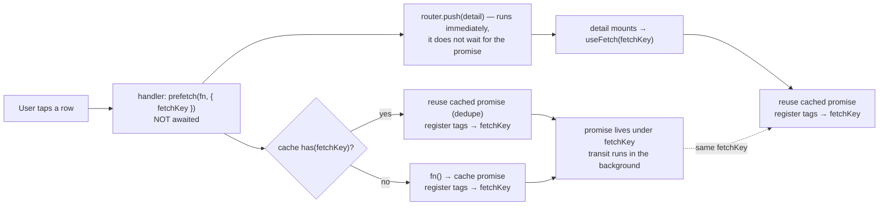
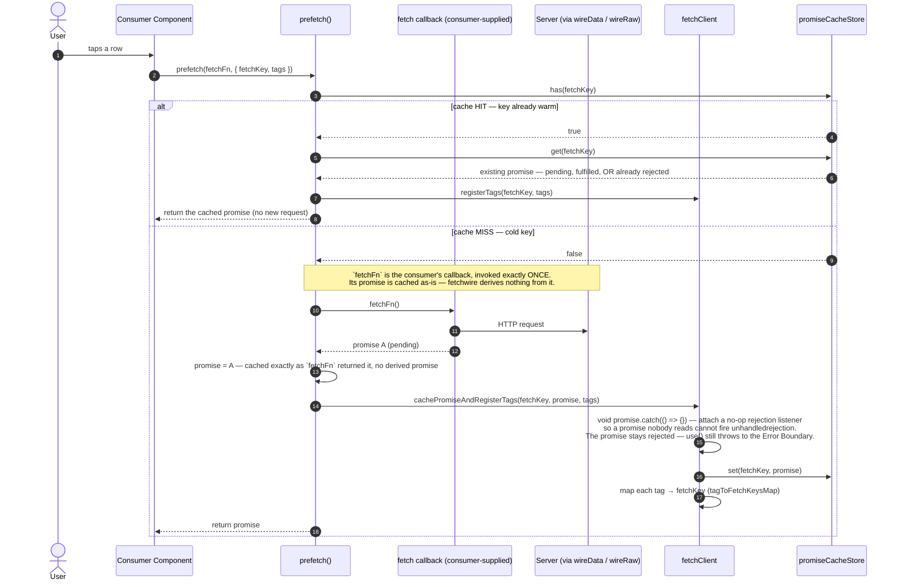
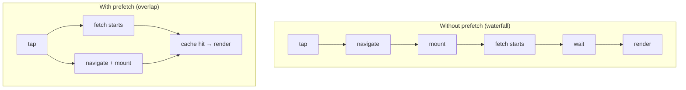

# prefetch — Cache-Warming Flow

The **eager** primitive: start a request **before** the component that needs it renders, store the
in-flight promise under a `fetchKey`, and let the later [`useFetch`](./USE-FETCH-FLOW.md) /
[`useFetchFn`](./USE-FETCH-FN-FLOW.md) pick it up instead of firing its own request.

> **The one idea that defines this flow.** `prefetch` is not a hook and holds no state. It's just a plain
> function — typically called from an event handler — that puts a promise into the shared
> `promiseCacheStore` under a `fetchKey`.

---

## Where it fits

The **same `fetchKey`** is the contract: the value passed to `prefetch` must match the one the
destination reader uses, or the reader will fetch again on its own.

---

## The flow — warm, navigate, hand off

> **`has(fetchKey)`.** If the key is already warm (a previous prefetch, or a reader is
> already mounted), `prefetch` returns the existing promise instead of starting a second request. One key
> = one in-flight request, shared by everyone who asks for it.

---

## prefetch vs a reader's own fetch

---

## Notes

- **Not a hook** `prefetch` can be called from any imperative context (event handler,
  navigation callback). It has no React state and no subscription; it only seeds `promiseCacheStore`.
- **The key is the whole contract.** Hand-off works only when `prefetch`'s `fetchKey` is byte-for-byte
  the one the destination [`useFetch`](./USE-FETCH-FLOW.md)/[`useFetchFn`](./USE-FETCH-FN-FLOW.md) uses.
  A mismatch silently degrades to a normal (duplicate) fetch.
- **Tags register on every call.** The promise cache and the tag map
  (`tagToFetchKeysMap`) are independent; a warm key means only the first one is already done, so
  `prefetch` registers `tags` on the cache-hit path too. Registrations _accumulate as a union_ (never
  overridden), so `prefetch` and the reader consuming the same `fetchKey` should declare the **same**
  `tags` — differing sets only make the key invalidatable by _both_, an extra (safe) refetch rather
  than stale data.
- **First read reuses it; a refresh replaces it.** A reader's _initial_ fetch honors the cache hit; an
  explicit `refreshFetch`/`refreshFetchFn` skips the cache read and overwrites the entry. So a warmed key
  speeds up the first paint without pinning stale data.

---

**Readers that consume a warmed key:** [USE-FETCH-FLOW](./USE-FETCH-FLOW.md) ·
[USE-FETCH-FN-FLOW](./USE-FETCH-FN-FLOW.md).
**What clears a warmed key:** [USE-MUTATION-FN-FLOW](./USE-MUTATION-FN-FLOW.md).
