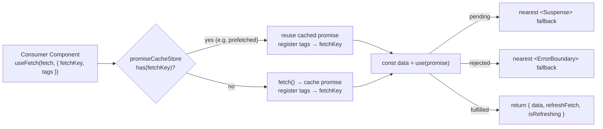
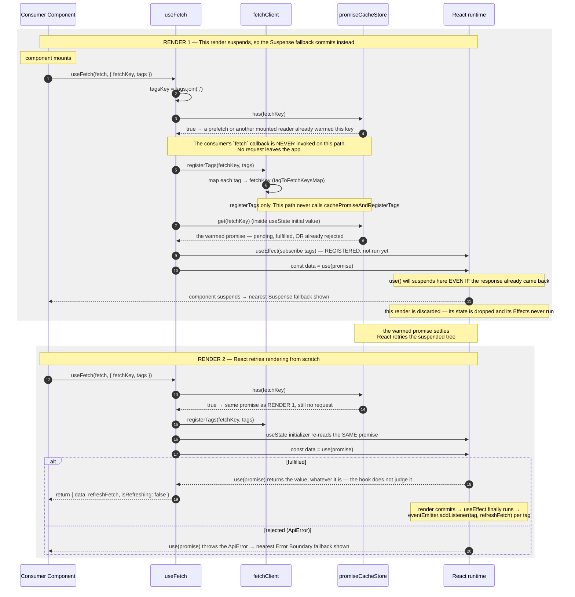
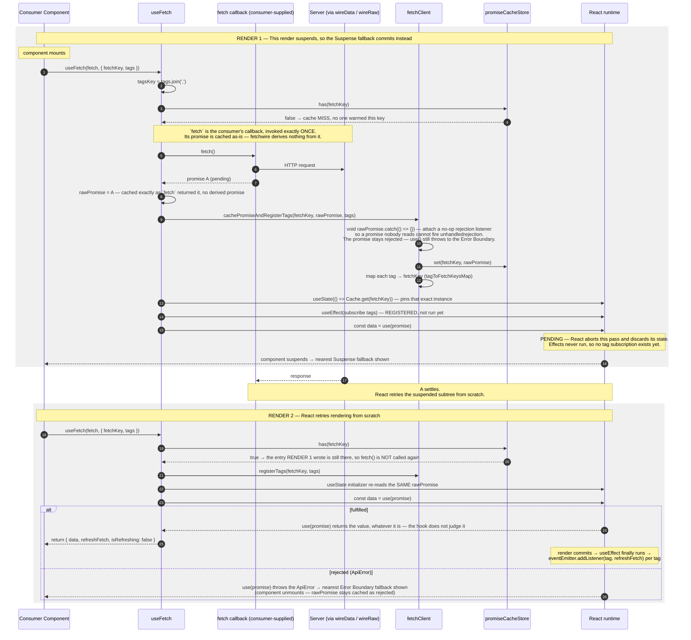
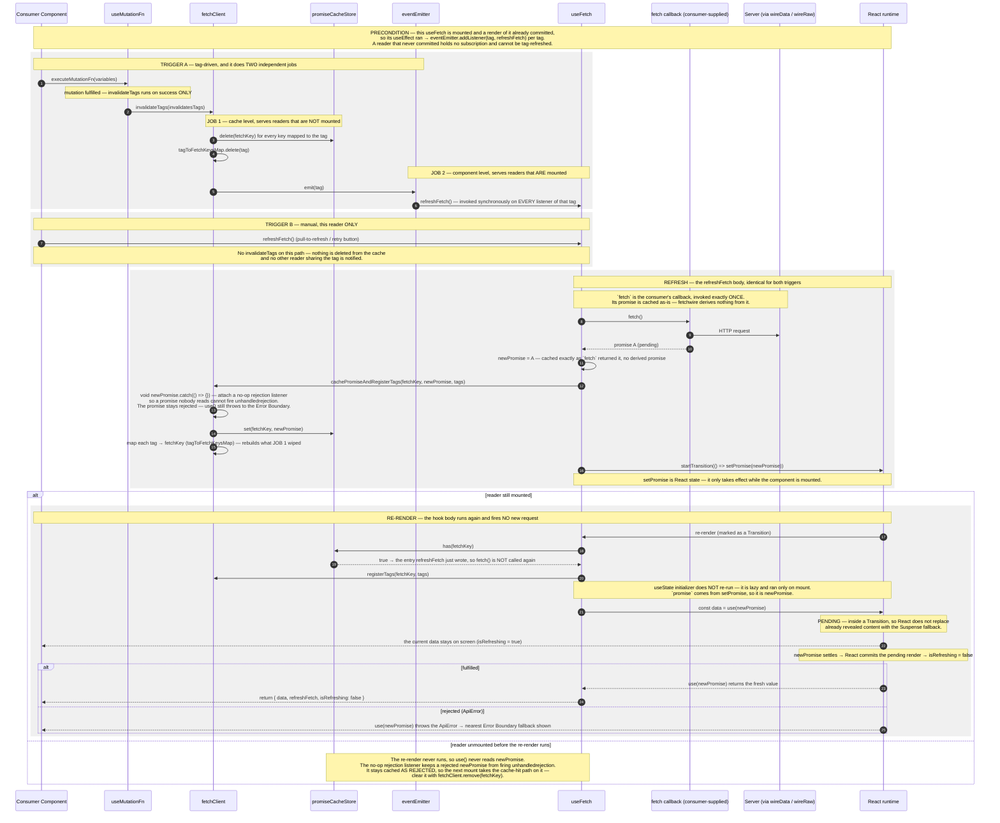

# useFetch — Suspense Data Flow

The **declarative** read hook: fetch on first render, **suspend** the component while the promise is
pending, and surface data through React's `use()`. The hook's job is to make sure the **same promise instance** is reused across renders.

> **The one idea that defines this flow.** `useFetch` hands a **cached promise** to `use(promise)` and lets **React** decide:

1. pending → the nearest `<Suspense>` fallback
2. rejected → the nearest `<ErrorBoundary>` fallback
3. fulfilled → the data.

---

## Where it fits

The consumer tree **must** provide both boundaries — `<Suspense>` for the pending state and
`<ErrorBoundary>` for a rejected promise. `useFetch` itself renders neither.

---

## First render — Cache hit

The trigger is **render on mount**, not a user gesture. This is the branch taken when a
[`prefetch`](./PREFETCH-FLOW.md) (or an already-mounted reader) warmed the same `fetchKey` — the hook
fires **no** request and reuses the stored promise.

---

## First render — Cache miss

The default path on mount when nothing warmed the key: fire the request, cache the in-flight promise
through `fetchClient`, then suspend on it.

---

## Refresh — tag-driven & manual

A mounted `useFetch` subscribes each of its `tags` to the `eventEmitter`. A
[`useMutationFn`](./USE-MUTATION-FN-FLOW.md) that invalidates a matching tag — or a manual
`refreshFetch()` call — swaps in a **new** promise **without** unmounting, keeping current data visible via
`useTransition`.

> **Why `useTransition` for refresh but Suspense for the first load.** On first load there is no data to
> show, so suspending to a fallback is correct. On refresh there _is_ data on screen; a transition marks
> the new promise as non-urgent so React keeps the old UI visible (`isRefreshing = true`) instead of
> flashing the Suspense fallback again.

> **Why `tagsKey = tags.join(',')`.** `options.tags` is a new array on every render, which would make the
> subscription `useEffect` re-run each render. Joining to a stable string key makes the effect depend on
> the tag _values_, not the array identity. (Constraint: tag strings must not contain commas.)

---

## Notes

- **Boundaries are the consumer's responsibility.** `useFetch` returns no `isLoading`/`error` for the
  initial fetch — those states _are_ the `<Suspense>` and `<ErrorBoundary>` around the component. For an
  imperative, flag-based read, use [`useFetchFn`](./USE-FETCH-FN-FLOW.md).
- **`fetchKey` is the identity of the read.** It dedupes concurrent reads, links a
  [`prefetch`](./PREFETCH-FLOW.md) to the hook that later consumes it, and is the unit that
  `fetchClient.invalidateTags` clears.
- **`tags` connect reads to writes.** A read subscribes to tags; a
  [mutation](./USE-MUTATION-FN-FLOW.md) invalidates tags.
- **Two stores, not one — tags register on every call.** The promise cache and the tag map
  (`tagToFetchKeysMap`) are independent; a warm key means only the first one is already done, so the
  cache-hit path registers `tags` too. Registrations _accumulate as a union_ (never overridden), so a
  [`prefetch`](./PREFETCH-FLOW.md) and the reader consuming the same `fetchKey` should declare the **same**
  `tags` — differing sets only make the key invalidatable by _both_, an extra (safe) refetch rather than
  stale data.
- **`refreshFetch` requires a mounted component.** It sets internal promise state via `useTransition`, so
  it only has an effect while the component is rendered. To force a fresh fetch from _outside_ a mounted
  reader (e.g. resetting a rejected key), clear the cache with `fetchClient.remove(fetchKey)` and let the
  next mount re-fetch.

---

**Manual/flag-based sibling:** [USE-FETCH-FN-FLOW](./USE-FETCH-FN-FLOW.md).
**What invalidates a tag:** [USE-MUTATION-FN-FLOW](./USE-MUTATION-FN-FLOW.md).
**Warming the cache before mount:** [PREFETCH-FLOW](./PREFETCH-FLOW.md).
