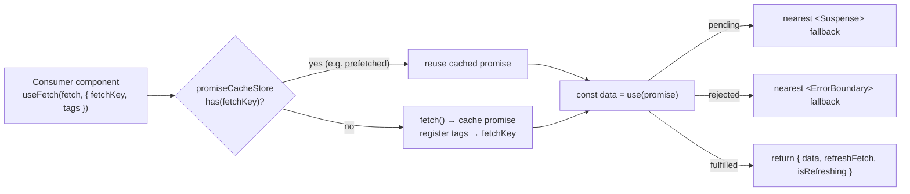
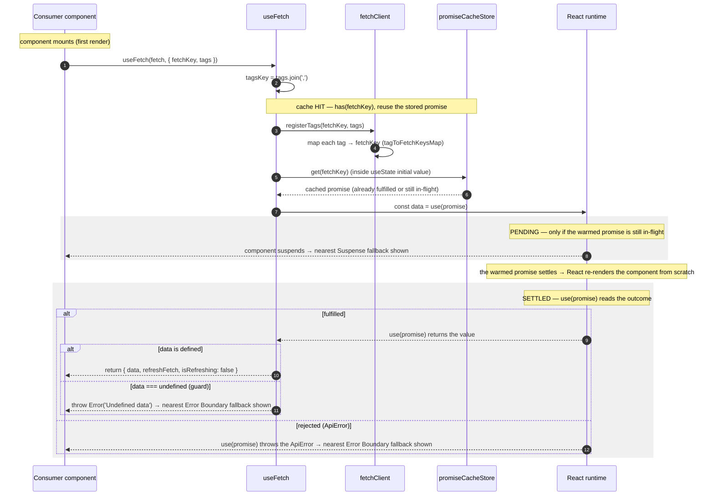
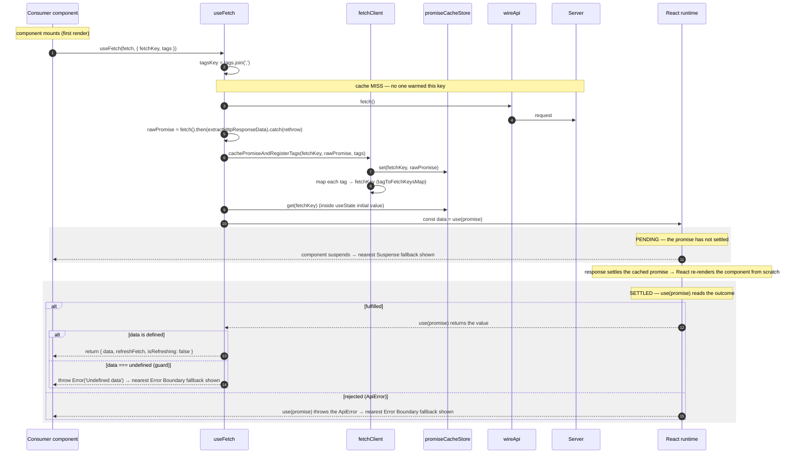
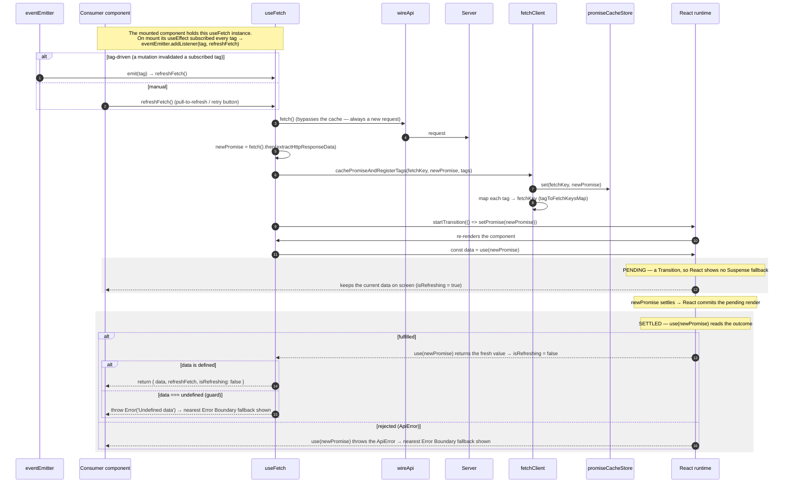

# useFetch — Suspense Data Flow

The **declarative** read hook: fetch on first render, **suspend** the component while the promise is
pending, and surface data through React's `use()`.

> **The one idea that defines this flow.** `useFetch` never returns a loading or error flag for the
> initial fetch. It hands a **cached promise** to `use(promise)` and lets **React** decide: pending →
> the nearest `<Suspense>` fallback, rejected → the nearest `<ErrorBoundary>` fallback, fulfilled → the
> data. The hook's job is to make sure the **same promise instance** is reused across renders.

---

## Where it fits

The consumer tree **must** provide both boundaries — `<Suspense>` for the pending state and
`<ErrorBoundary>` for a rejected promise. `useFetch` itself renders neither.

---

## First render — Cache hit (reuse a warmed promise)

The trigger is **render on mount**, not a user gesture. This is the branch taken when a
[`prefetch`](./PREFETCH-FLOW.md) (or an already-mounted reader) warmed the same `fetchKey` — the hook
fires **no** request and reuses the stored promise.

> **Why `useState(() => promise)` here.** The lazy
> `useState` initializer reads the cached promise **once** and keeps that exact instance in state, so
> every re-render hands `use()` the _same_ promise —
> [documented requirement](https://react.dev/reference/react/use), which stops React from re-suspending in
> a loop.

---

## First render — Cache miss (fetch & suspend)

The default path on mount when nothing warmed the key: fire the request, cache the in-flight promise
through `fetchClient`, then suspend on it.

> **Why `.catch(rethrow)` on the cached promise.** The rejected promise is kept in the cache **as
> rejected** on purpose. Deleting it on failure would let the next render start a fresh fetch and
> re-suspend — the same infinite loop. Keeping it lets `use()` re-throw the same error to the
> `ErrorBoundary` deterministically on every render until the key is explicitly cleared with
> `fetchClient.remove(fetchKey)`.

> **Why `extractHttpResponseData`.** The `fetch` function may return either a full `HttpResponse<T>`
> envelope (`{ data, message, status }`) or a raw `T`. The hook unwraps the envelope to `data` so the
> consumer always reads the payload directly.

---

## Refresh — tag-driven & manual

A mounted `useFetch` subscribes each of its `tags` to the `eventEmitter`. A
[`useMutationFn`](./USE-MUTATION-FN-FLOW.md) that invalidates a matching tag — or a manual
`refreshFetch()` call — swaps in a **new** promise **without** unmounting, keeping current data visible via
`useTransition`.

> **Why `useTransition` for refresh but Suspense for the first load.** On first load there is no data to
> show, so suspending to a fallback is correct. On refresh there _is_ data on screen; a transition marks
> the new promise as non-urgent so React keeps the old UI visible (`isRefreshing = true`) instead of
> flashing the Suspense fallback again.

> **Why `tagsKey = tags.join(',')`.** `options.tags` is a new array on every render, which would make the
> subscription `useEffect` re-run each render. Joining to a stable string key makes the effect depend on
> the tag _values_, not the array identity. (Constraint: tag strings must not contain commas.)

---

## Notes

- **Boundaries are the consumer's responsibility.** `useFetch` returns no `isLoading`/`error` for the
  initial fetch — those states _are_ the `<Suspense>` and `<ErrorBoundary>` around the component. Without
  them, a pending fetch suspends with no fallback and a rejected fetch bubbles unbounded. For an
  imperative, flag-based read instead, use [`useFetchFn`](./USE-FETCH-FN-FLOW.md).
- **`fetchKey` is the identity of the read.** It dedupes concurrent reads, links a
  [`prefetch`](./PREFETCH-FLOW.md) to the hook that later consumes it, and is the unit that
  `fetchClient.invalidateTags` clears. Convention: `resource-name` + dynamic segments (`"trip-" + id`).
- **`tags` connect reads to writes.** A read subscribes to tags; a
  [mutation](./USE-MUTATION-FN-FLOW.md) invalidates tags. The overlap is what turns a successful write
  into an automatic re-read of every mounted reader sharing that tag.
- **Tags register should match the prefetch's tags.** `prefetch` and the reader that consumes the same `fetchKey`
  should declare the **same** `tags`. Tag associations _accumulate as a union_ (not overriden), so
  differing tags make the key just becomes invalidatable by _both_ sets, which only ever
  causes an extra (safe) refetch, never stale data. Still, we should keep them
  identical so "what invalidates this key" has one obvious answer.
- **`refreshFetch` requires a mounted component.** It sets internal promise state via `useTransition`, so
  it only has an effect while the component is rendered. To force a fresh fetch from _outside_ a mounted
  reader (e.g. resetting a rejected key), clear the cache with `fetchClient.remove(fetchKey)` and let the
  next mount re-fetch.

---

**Manual/flag-based sibling:** [USE-FETCH-FN-FLOW](./USE-FETCH-FN-FLOW.md).
**What invalidates a tag:** [USE-MUTATION-FN-FLOW](./USE-MUTATION-FN-FLOW.md).
**Warming the cache before mount:** [PREFETCH-FLOW](./PREFETCH-FLOW.md).
