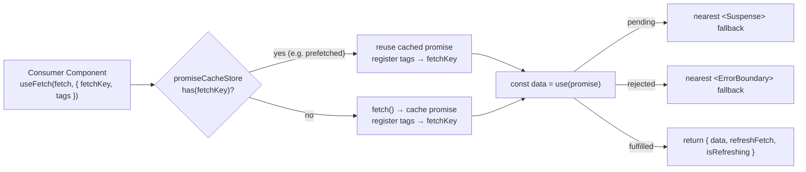
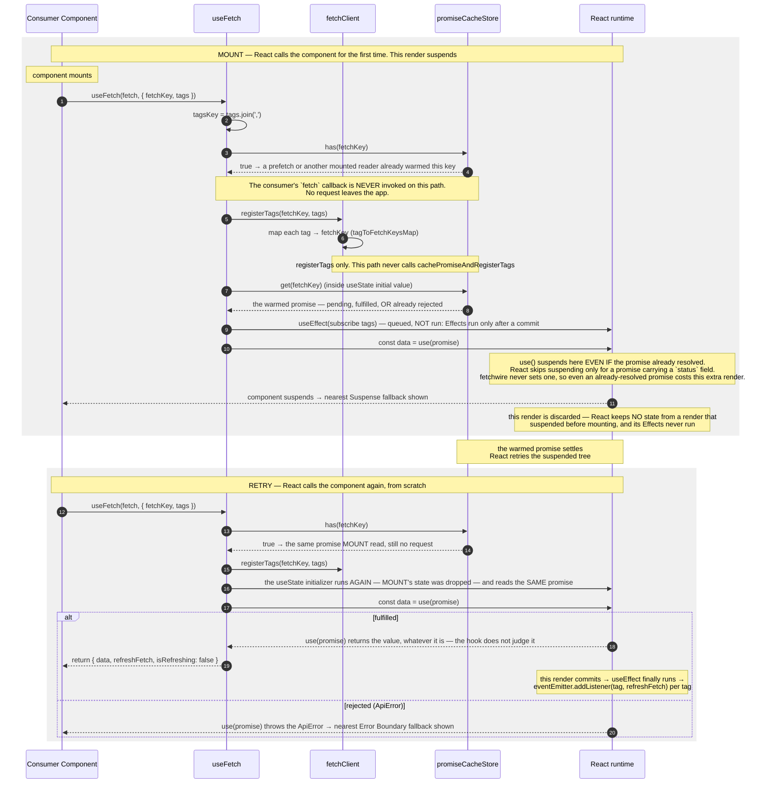
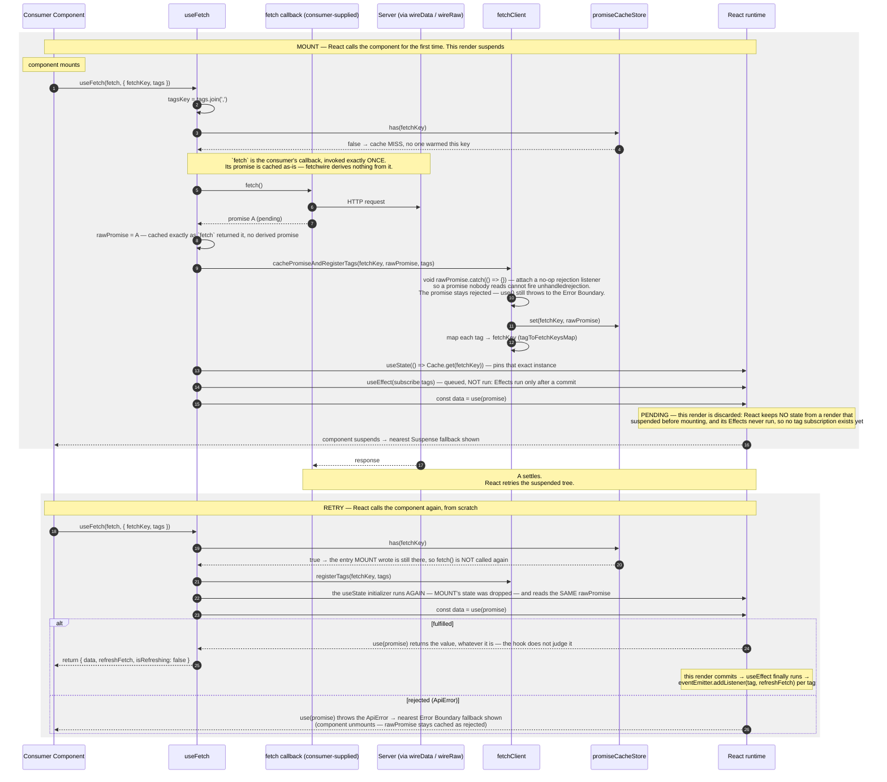
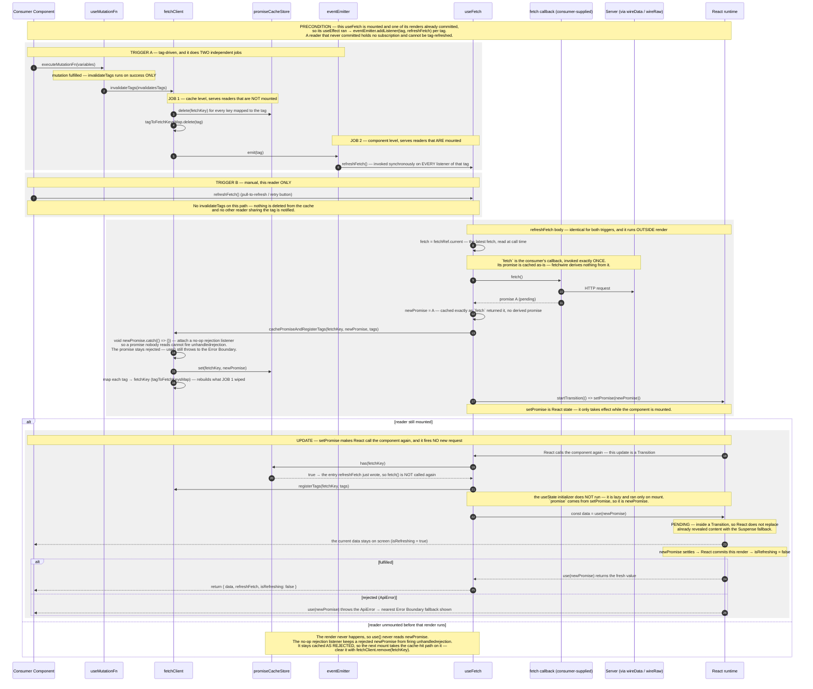
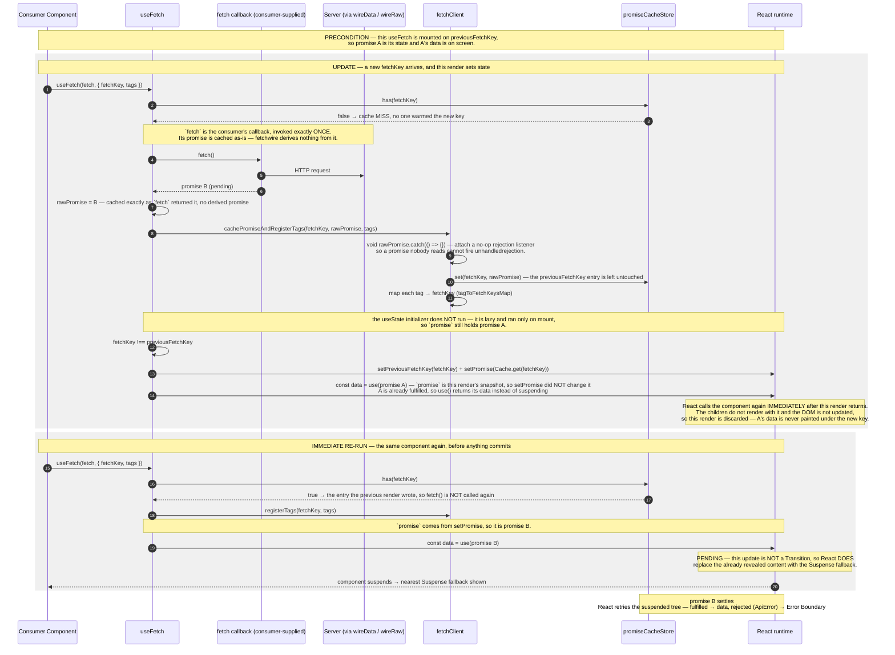

# useFetch — Suspense Data Flow

The **declarative** read hook: fetch on first render, **suspend** the component while the promise is
pending, and surface data through React's `use()`. The hook's job is to make sure the **same promise instance** is reused across renders.

> **The one idea that defines this flow.** `useFetch` hands a **cached promise** to `use(promise)` and lets **React** decide:

1. pending → the nearest `<Suspense>` fallback
2. rejected → the nearest `<ErrorBoundary>` fallback
3. fulfilled → the data.

---

## Where it fits

The consumer tree **must** provide both boundaries — `<Suspense>` for the pending state and
`<ErrorBoundary>` for a rejected promise. `useFetch` itself renders neither.

---

## Reading the render bands

Every shaded band below is **one render** — *"Rendering is React calling your components."* Four
different things make React call this component, and each band says which one:

| Band | What triggered this render |
| --- | --- |
| `MOUNT` | the component mounted — React's initial render |
| `RETRY` | the promise it suspended on settled, so React **retries rendering from scratch**, keeping **no** state from the suspended render |
| `UPDATE` | a state update on a mounted component — `setPromise`, or a new `fetchKey` arriving from above |
| `IMMEDIATE RE-RUN` | `setPromise` was called **during** the previous render, so React calls the component again before rendering children or touching the DOM |

A render ends one of two ways: it **commits** (React updates the DOM, then runs Effects), or it
**suspends** and is discarded (no DOM, no Effects). That is why a suspended render never subscribes to
tags.

---

## First render — Cache hit

The trigger is **render on mount**, not a user gesture. This is the branch taken when a
[`prefetch`](./PREFETCH-FLOW.md) (or an already-mounted reader) warmed the same `fetchKey` — the hook
fires **no** request and reuses the stored promise.

---

## First render — Cache miss

The default path on mount when nothing warmed the key: fire the request, cache the in-flight promise
through `fetchClient`, then suspend on it.

---

## Refresh — tag-driven & manual

A mounted `useFetch` subscribes each of its `tags` to the `eventEmitter`. A
[`useMutationFn`](./USE-MUTATION-FN-FLOW.md) that invalidates a matching tag — or a manual
`refreshFetch()` call — swaps in a **new** promise **without** unmounting, keeping current data visible via
`useTransition`.

> **Why `useTransition` for refresh but Suspense for the first load.** On first load there is no data to
> show, so suspending to a fallback is correct. On refresh there _is_ data on screen; a transition marks
> the new promise as non-urgent so React keeps the old UI visible (`isRefreshing = true`) instead of
> flashing the Suspense fallback again.

> **Why `tagsKey = tags.join(',')`.** `options.tags` is a new array on every render, which would make the
> subscription `useEffect` re-run each render. Joining to a stable string key makes the effect depend on
> the tag _values_, not the array identity. (Constraint: tag strings must not contain commas.)

---

## `fetchKey` changes — a new read, not a refresh

`fetchKey` is the identity of the read, so changing it asks for a **different** resource, not a fresh copy
of the same one. The trigger is a **new key arriving on a mounted reader** — not `refreshFetch()`, not a
tag event — and the hook moves its promise state onto that key **during** the render.

> **Why the promise is re-pointed during render, not in an Effect.** An Effect runs only after a render
> commits, so the browser would paint one frame of the previous key's data under the new key before the
> correction landed. Setting state during render keeps that frame from existing: React calls the
> component again before its children render and before the DOM is touched. The
> `fetchKey !== previousFetchKey` comparison is what keeps it from looping. (React's documented pattern
> for adjusting state when a prop changes —
> [You Might Not Need an Effect](https://react.dev/learn/you-might-not-need-an-effect).)

> **Why a key change suspends but a refresh does not.** `refreshFetch` swaps the promise inside
> `startTransition`, which is what keeps the current data on screen. This swap runs during render, with no
> `startTransition` around it, so the update stays urgent and the Suspense fallback replaces the current
> data. Keeping it on screen is the caller's job — change whatever the key is built from inside their own
> `startTransition`.

---

## Notes

- **Boundaries are the consumer's responsibility.** `useFetch` returns no `isLoading`/`error` for the
  initial fetch — those states _are_ the `<Suspense>` and `<ErrorBoundary>` around the component. For an
  imperative, flag-based read, use [`useFetchFn`](./USE-FETCH-FN-FLOW.md).
- **`fetchKey` is the identity of the read.** It dedupes concurrent reads, links a
  [`prefetch`](./PREFETCH-FLOW.md) to the hook that later consumes it, and is the unit that
  `fetchClient.invalidateTags` clears.
- **`tags` connect reads to writes.** A read subscribes to tags; a
  [mutation](./USE-MUTATION-FN-FLOW.md) invalidates tags.
- **Two stores, not one — tags register on every call.** The promise cache and the tag map
  (`tagToFetchKeysMap`) are independent; a warm key means only the first one is already done, so the
  cache-hit path registers `tags` too. Registrations _accumulate as a union_ (never overridden), so a
  [`prefetch`](./PREFETCH-FLOW.md) and the reader consuming the same `fetchKey` should declare the **same**
  `tags` — differing sets only make the key invalidatable by _both_, an extra (safe) refetch rather than
  stale data.
- **`refreshFetch` requires a mounted component.** It sets internal promise state via `useTransition`, so
  it only has an effect while the component is rendered. To force a fresh fetch from _outside_ a mounted
  reader (e.g. resetting a rejected key), clear the cache with `fetchClient.remove(fetchKey)` and let the
  next mount re-fetch.

---

**Manual/flag-based sibling:** [USE-FETCH-FN-FLOW](./USE-FETCH-FN-FLOW.md).
**What invalidates a tag:** [USE-MUTATION-FN-FLOW](./USE-MUTATION-FN-FLOW.md).
**Warming the cache before mount:** [PREFETCH-FLOW](./PREFETCH-FLOW.md).
