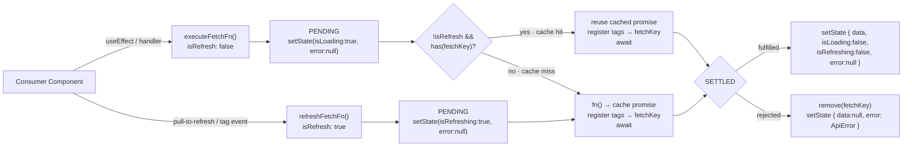
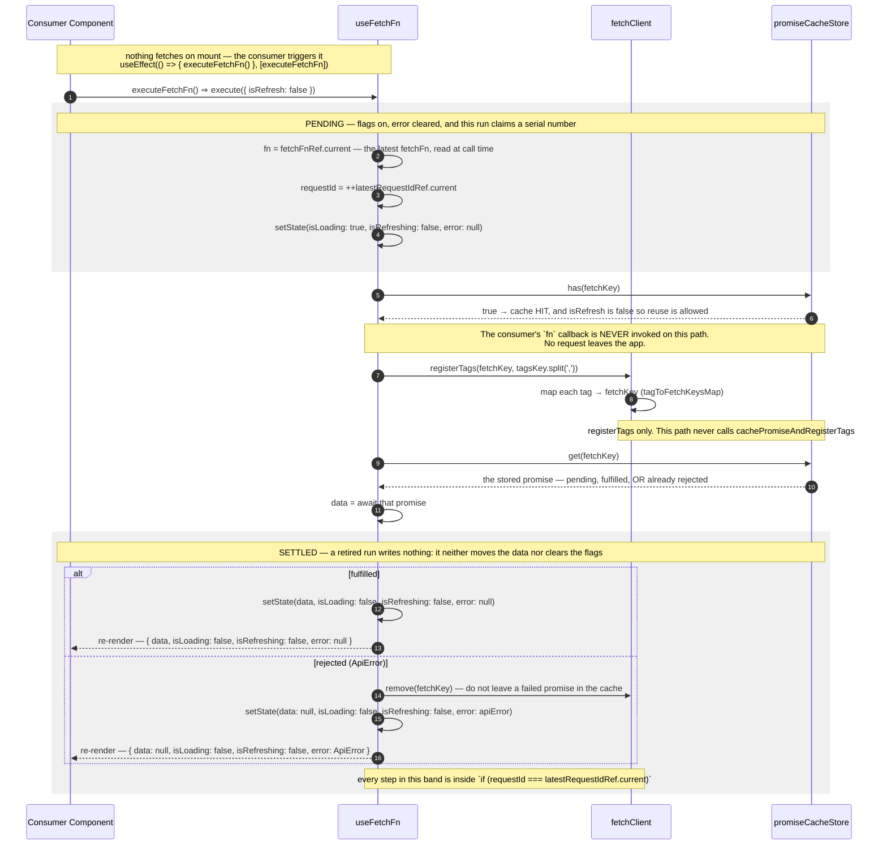
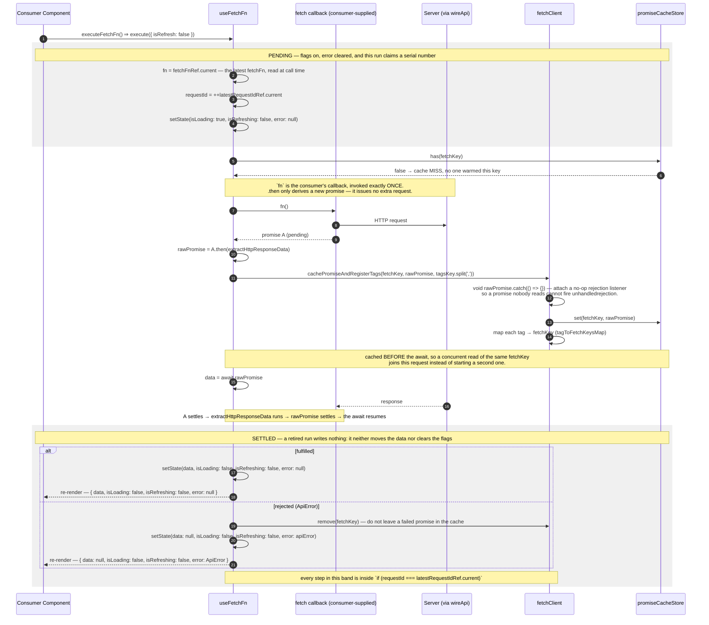
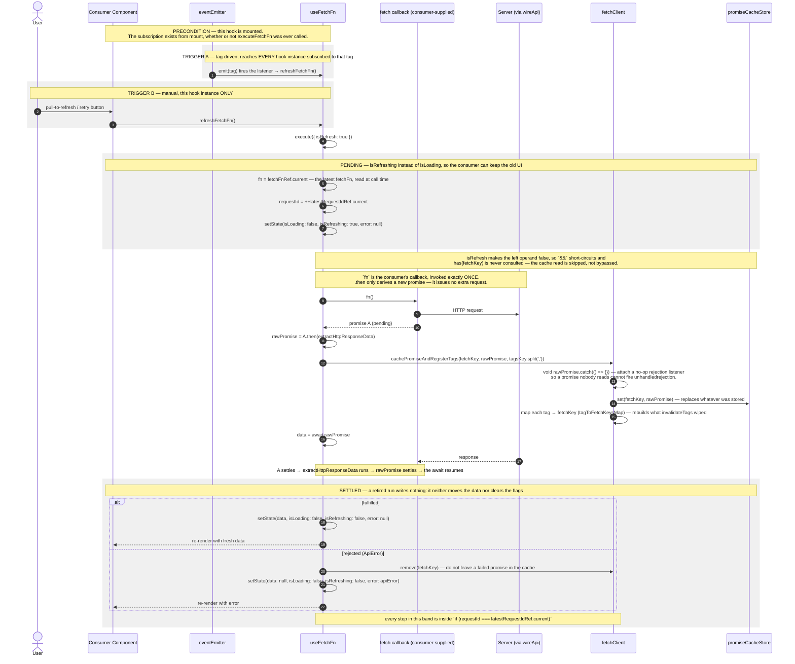

# useFetchFn — Imperative Data Flow

The **imperative** fetch hook: it exposes plain state — `data`, `isLoading`, `isRefreshing`, `error` — and a
function for us to call ourselves.

> **The one idea that defines this flow.** `useFetchFn` does **not** suspend and does **not** throw to an
> `ErrorBoundary`. It models the promise's whole lifecycle — **pending → fulfilled | rejected** — as three
> shapes of local `useState` (`isLoading`/`isRefreshing`, `data`, `error`). Use this when we want manual
> control instead of Suspense.

> Everything below is two readings of a _single_ `if/else` inside
> `execute` ([use-fetch-fn.ts](../../src/hook/use-fetch-fn.ts)):
>
> ```
> if (!isRefresh && promiseCacheStore.has(fetchKey))  → cache HIT:  reuse the stored promise
> else                                                → cache MISS: fire a fresh request
> ```

---

## Where it fits

Read the map as three bands: **PENDING** (flags on, a serial number claimed), the branch (**hit** reuse /
**miss** fetch), then **SETTLED** (`fulfilled` / `rejected`). Every path starts and ends in the same two
bands — that symmetry is what the sequence diagrams below preserve.



Unlike `useFetch`, there is **no** `<Suspense>`/`<ErrorBoundary>` in the picture — every branch ends in
state the consumer reads.

---

## executeFetchFn — Cache hit

Reached when `isRefresh` is false **and** the `fetchKey` is already in the Promise cache. That warmth does
not have to come from [`prefetch`](./PREFETCH-FLOW.md): a previous `executeFetchFn`, a `refreshFetchFn`, or
a mounted [`useFetch`](./USE-FETCH-FLOW.md) on the same key all write the same store.

The practical consequence: **a second `executeFetchFn()` returns the first call's data without touching the
network.** When we need fresh data, call `refreshFetchFn()`.



---

## executeFetchFn — Cache miss

The default path when nothing warmed the key. The hook fires the request itself and caches the in-flight
promise **before** awaiting it.



---

## Refresh — tag-driven & manual

A refresh is the same `execute` body with `isRefresh: true`. It always issues a request and always
overwrites the cache entry.



> **Why refresh writes `isRefreshing`, not `isLoading`.** The two flags let the consumer distinguish the
> _first_ load (skeleton) from a _background_ refresh (keep old UI, show a spinner). `isLoading` is set
> only when `isRefresh` is false.

> **Why only the newest run may write.** `execute` is fed by sources that do not know about each other —
> the consumer's effect, a tag listener, a pull-to-refresh — so several runs can be in flight against one
> shared state, and responses arrive in a different order than they were sent. Each run claims a serial
> number on entry (`++latestRequestIdRef.current`) and may write only while it still holds the latest one.
> Without it the slowest run wins by landing last, which shows the **older** data.

> **Why `tagsKey = tags.join(',')`.** `options.tags` is a new array on every render. Here the joined string
> does double duty: it keeps the subscription `useEffect` from re-running each render, **and** it is a
> dependency of the `useCallback` that memoizes `execute` — without a stable primitive, `executeFetchFn`
> would change identity every render and the consumer's `useEffect(() => { executeFetchFn() },
> [executeFetchFn])` would loop forever. (Constraint: tag strings must not contain commas.)

---

## Notes

- **State.** `useFetchFn` is the imperative counterpart to `useFetch`. Errors land in
  `error` for the consumer to render inline; nothing is thrown to an `ErrorBoundary` and nothing suspends.
  Choose it when we need a retry button, conditional/lazy fetching, or an error message beside the data
  rather than a boundary fallback. → [USE-FETCH-FLOW](./USE-FETCH-FLOW.md) for the Suspense variant.
- **A repeat `executeFetchFn()` does not refetch.** The first call caches its promise under `fetchKey`, so
  the next call takes the cache-hit path and resolves to the same data without a request. Use
  `refreshFetchFn()` to force the network.
- **A tag event refreshes this hook even if it never fetched.** The subscription `useEffect` runs on mount
  unconditionally, so a mutation invalidating a subscribed tag calls `refreshFetchFn()` — and issues a
  request — on a hook whose consumer never called `executeFetchFn()`. For a screen that must stay idle
  until asked, omit `tags` and refresh it manually.
- **Overlapping runs resolve by recency, not by arrival.** Two `refreshFetchFn()` calls (or a
  `fetchKey` that changes while a run is in flight) produce two independent requests writing one
  state. The newer run always wins, whichever response lands last.
- **`reset()`** returns state to the idle shape (`data:null, isLoading:false, isRefreshing:false,
  error:null`) and retires every in-flight run, so a late response cannot resurrect what was just
  cleared. It does not touch the Promise cache.
- **Tags register on every call.** The promise cache and the tag map
  (`tagToFetchKeysMap`) are independent; a warm key means only the first one is already done, so the
  cache-hit path registers `tags` too. Registrations _accumulate as a union_ (never overridden), so a
  [`prefetch`](./PREFETCH-FLOW.md) and the reader consuming the same `fetchKey` should declare the **same**
  `tags` — differing sets only make the key invalidatable by _both_, an extra (safe) refetch rather than
  stale data.

---

**Suspense-based sibling:** [USE-FETCH-FLOW](./USE-FETCH-FLOW.md).
**What invalidates a tag:** [USE-MUTATION-FN-FLOW](./USE-MUTATION-FN-FLOW.md).
**Warming the cache before mount:** [PREFETCH-FLOW](./PREFETCH-FLOW.md).
