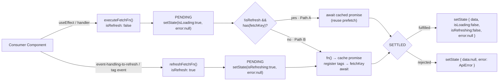
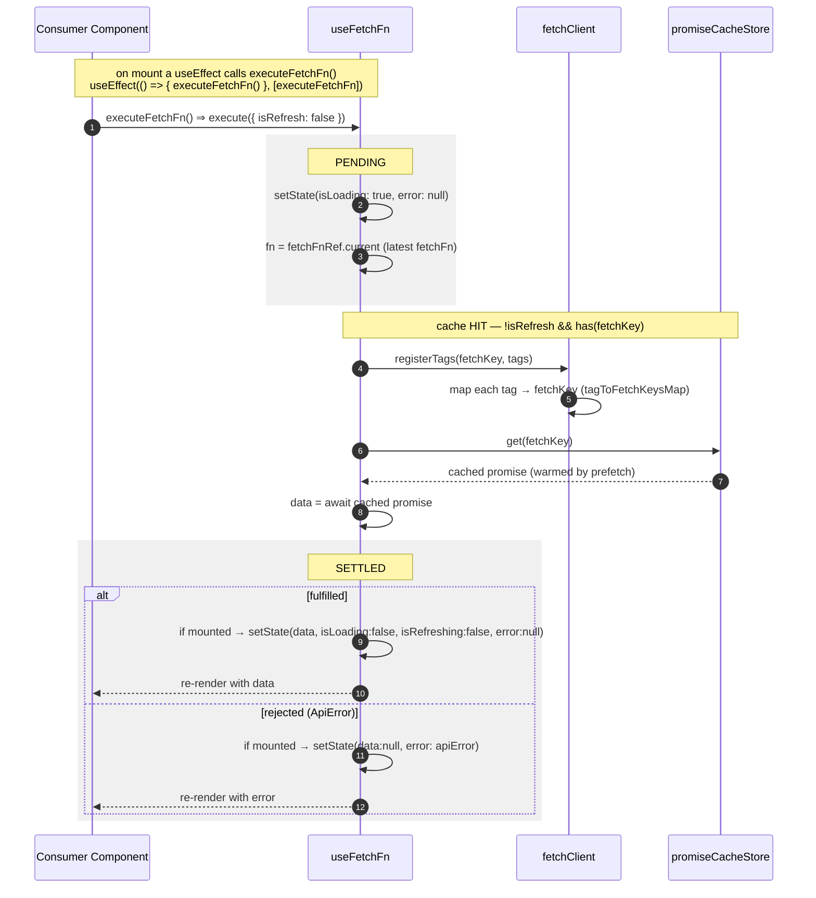
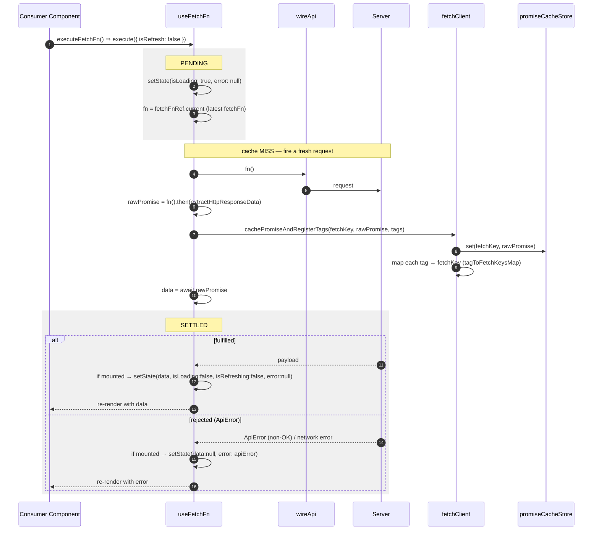
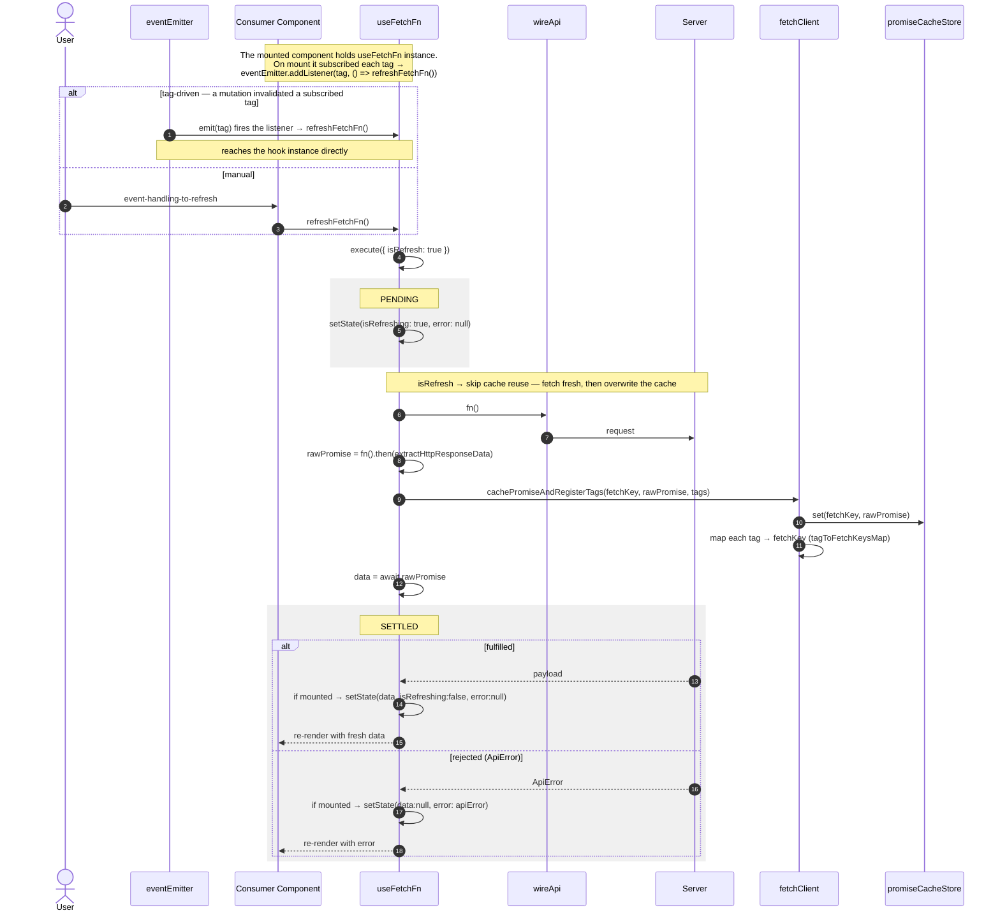

# useFetchFn — Imperative Data Flow

The **imperative** fetch hook: it exposes plain state — `data`, `isLoading`, `isRefreshing`, `error` — and a
function for us to call ourself.

> **The one idea that defines this flow.** `useFetchFn` does **not** suspend and does **not** throw to an
> `ErrorBoundary`. It models the promise's whole lifecycle — **pending → fulfilled | rejected** — as three
> shapes of local `useState` (`isLoading`/`isRefreshing`, `data`, `error`). Use this when we want manual
> control instead of Suspense.

> Everything below is two readings of a _single_ `if/else` inside
> `execute` ([use-fetch-fn.ts](../../src/hook/use-fetch-fn.ts)):
>
> ```
> if (!isRefresh && promiseCacheStore.has(fetchKey))  → Path A: reuse the cached promise
> else                                                → Path B: fire a fresh request
> ```

---

## Where it fits

Read the map as three bands: **PENDING** (flags on), the branch (**A** reuse / **B** fetch), then
**SETTLED** (`fulfilled` / `rejected`). Every path starts and ends in the same two bands — that symmetry is
what the sequence diagrams below preserve.



Unlike `useFetch`, there is **no** `<Suspense>`/`<ErrorBoundary>` in the picture — every branch ends in
state the consumer reads.

---

## Path A — Cache hit (reuse a prefetched promise)

Reachable **only** from `executeFetchFn` (never a refresh), and only when a
[`prefetch`](./PREFETCH-FLOW.md) already warmed the same `fetchKey`.



> **Why cache-hit only when `!isRefresh`.** A
> `refreshFetchFn` deliberately **bypasses** the cache (Path B) to force fresh data.

---

## Path B — Cache miss (fresh network request)

Reachable from `executeFetchFn` when **no** prefetch warmed the key (the `fetchKey` is not in the cache
store), and from **every** `refreshFetchFn`. Here the hook fires the request itself and caches the
in-flight promise.



> **Why need the `isMounted` ref guard.** `execute` is async; the component may unmount mid-flight (navigation).
> The guard prevents a `setState` on an unmounted component — the result is simply dropped.

---

## Refresh — Path B, triggered by a tag or a gesture

A refresh is just **Path B with `isRefresh: true`**: it always skips the cache and always hits the network.



> **Why refresh writes `isRefreshing`, not `isLoading`.** The two flags let the consumer distinguish the
> _first_ load (skeleton) from a _background_ refresh (keep old UI, show a spinner). `isLoading` is set
> only when `isRefresh` is false.

---

## Notes

- **State, not boundaries.** `useFetchFn` is the imperative counterpart to `useFetch`. Errors land in
  `error` for the consumer to render inline; nothing is thrown to an `ErrorBoundary` and nothing suspends.
  Choose it when we need a retry button, conditional/lazy fetching, or an error message beside the data
  rather than a boundary fallback. → [USE-FETCH-FLOW](./USE-FETCH-FLOW.md) for the Suspense variant.
- **Must call `executeFetchFn` ourself.** Nothing fetches on mount automatically — the consumer triggers
  it (typically `useEffect(() => { executeFetchFn() }, [executeFetchFn])`). Because `executeFetchFn` is a
  stable reference, that effect runs once and does not loop.
- **`reset()`** returns state to the idle shape (`data:null, isLoading:false, isRefreshing:false,
error:null`) without touching the cache.
- **Tags register should match the prefetch's tags.** `prefetch` and the reader that consumes the same `fetchKey`
  should declare the **same** `tags`. Tag associations _accumulate as a union_ (not overriden), so
  differing tags make the key just becomes invalidatable by _both_ sets, which only ever
  causes an extra (safe) refetch, never stale data. Still, we should keep them
  identical so "what invalidates this key" has one obvious answer.

---

**What invalidates a tag:** [USE-MUTATION-FN-FLOW](./USE-MUTATION-FN-FLOW.md).
**Warming the cache before mount:** [PREFETCH-FLOW](./PREFETCH-FLOW.md).
