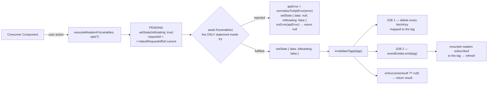
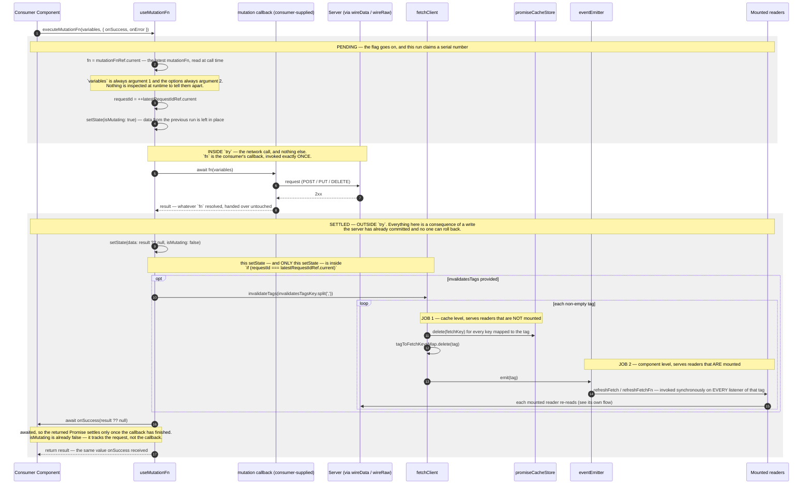
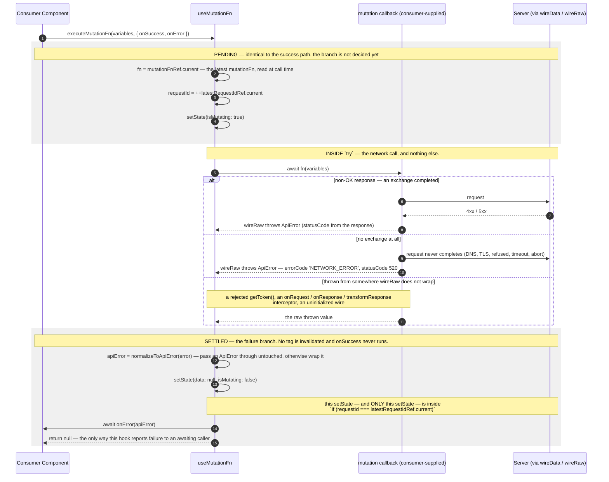
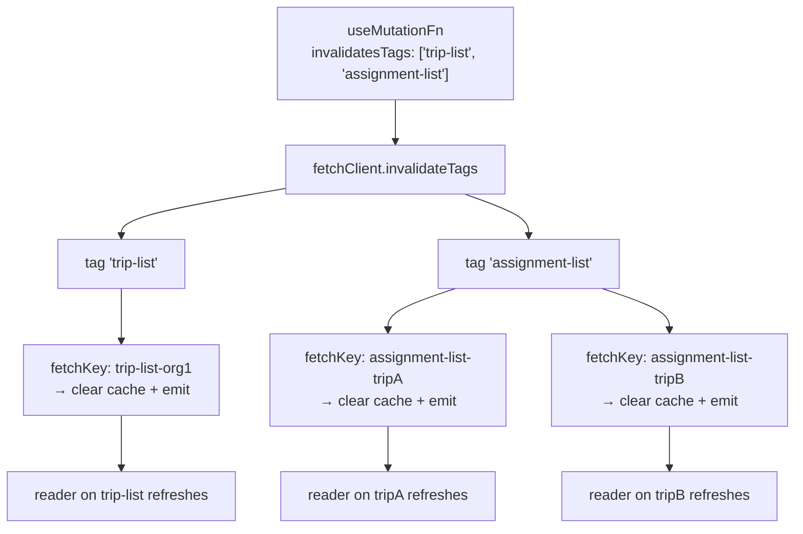

# useMutationFn — Write & Invalidate Flow

The **write** hook: run an async mutation, track `isMutating`, and — on success — **invalidate tags** so
every mounted reader ([`useFetch`](./USE-FETCH-FLOW.md) / [`useFetchFn`](./USE-FETCH-FN-FLOW.md))
subscribed to those tags re-reads.

> **The one idea that defines this flow.** A fetch is a **resource**, so it has an identity (`fetchKey`)
> and can be cached. A mutation is an **action** — it has no identity, so this hook never reads or writes
> `promiseCacheStore` for itself, and calling it twice really does send two requests. What it owns instead
> is the mutation's _after-effect_: on success it **clears the cached promises** of every `fetchKey`
> associated with the invalidated tags, and **emits** those tags so mounted readers refetch. Writes and
> reads never reference each other directly — they are wired only through shared tag strings.

> Everything below turns on where the `try` **ends** inside `executeMutationFn`
> ([use-mutation-fn.ts](../../src/hook/use-mutation-fn.ts)):
>
> ```
> try   { result = await fn(variables) }     → the mutation ITSELF
> catch { normalizeToApiError → setState → onError }  → the mutation FAILED
> ─────────────────────────────────────────────── the try ends HERE
> setState → invalidateTags → onSuccess       → the CONSEQUENCES of success
> ```
>
> A `try` has no power over the server: it cannot un-`POST` a committed write. The only thing it controls
> is the **report**. Widen it past the network call and a throw in the consequences turns a successful
> write into a false failure report.

---

## Where it fits

Read the map as three bands: **PENDING** (the flag goes on, a serial number is claimed), the network call
(the only thing inside `try`), then **SETTLED** (`fulfilled` / `rejected`). The sequence diagrams below
preserve the same three bands.



The **cache clear** and the **emit** are complementary: the emit refreshes readers that are _mounted now_;
the clear guarantees a reader that mounts _later_ starts from a fresh fetch instead of a stale cached
promise.

---

## executeMutationFn — Success

The mutation resolves, so the hook publishes the result and then runs the two consequences — invalidation
first, `onSuccess` second.



> **Why invalidation runs _before_ `onSuccess`.** By the time `onSuccess` runs, the cache is already
> cleared and readers already notified — so any navigation or UI update it performs happens on top of an
> already-invalidated cache, not a stale one.

---

## executeMutationFn — Failure

The `await` rejects. Nothing is invalidated, `onSuccess` never runs, and the thrown value is **normalized**
before it reaches the consumer.



---

## Tag fan-out — one write, many reads



---

## Notes

- **Callbacks are awaited — so `isMutating` and the returned Promise mean different things.**
  `onSuccess` / `onError` may return a Promise, and `executeMutationFn` waits for it. So
  `await executeMutationFn(...)` means "the write **and** everything the caller queued after it are
  done", while `isMutating` went false earlier — it tracks the **request**, not the callback. A callback
  that rejects rejects `executeMutationFn` (it does **not** route to `onError`, which lives inside the
  narrowed `try`).
- **Overlapping runs resolve by recency, not by arrival.** Two `executeMutationFn()` calls produce two
  independent requests writing one state. The newer run always wins, whichever response lands last — but
  both runs still invalidate their tags and still call their own callbacks.
- **Collection vs entity tags.** A broad tag (`'entity-list'`) refreshes _every_ reader of that collection
  in one write — simple, at the cost of refetching readers that may not have changed. A narrow, per-entity
  tag (`'entity-list-' + id`) refreshes exactly one. Choosing the granularity is the caller's modeling
  decision; fetchwire treats every tag identically.
- **`onSuccess` and the return value carry the same thing.** Both are whatever `mutationFn` resolved:
  `onSuccess` is passed `result ?? null`, and `executeMutationFn` returns `result` itself. The hook never
  inspects or unwraps it. To reach transport metadata such as `status`, have `mutationFn` call
  [`wireRaw`](../../src/core/wire.ts) instead of `wireData`.
- **Unmounting the caller does not abandon the write.** A mutation whose component unmounts before the
  request settles still invalidates its tags and still calls `onSuccess` / `onError`. Only `setState` is
  lost, and only because React drops it — the cache and the caller's callbacks are not the component's to
  cancel. Write `onSuccess` / `onError` so they tolerate running after their component is gone: reach for
  a router, a store, or an alert rather than a `setState` the caller no longer owns.
- **`reset()`** returns state to the idle shape (`data:null, isMutating:false`) and retires every in-flight
  run, so a late response cannot resurrect what was just cleared. It does not touch the Promise cache and
  emits nothing.

---

**Readers that react to invalidation:** [USE-FETCH-FLOW](./USE-FETCH-FLOW.md) ·
[USE-FETCH-FN-FLOW](./USE-FETCH-FN-FLOW.md).
**Warming a reader's cache before it mounts:** [PREFETCH-FLOW](./PREFETCH-FLOW.md).
