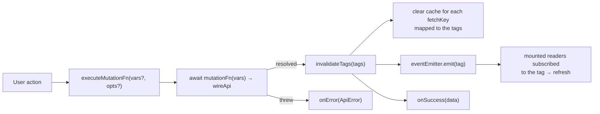
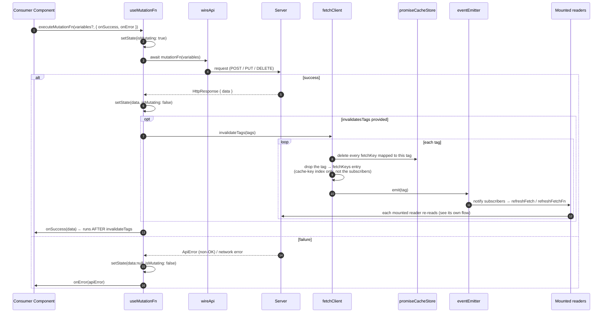
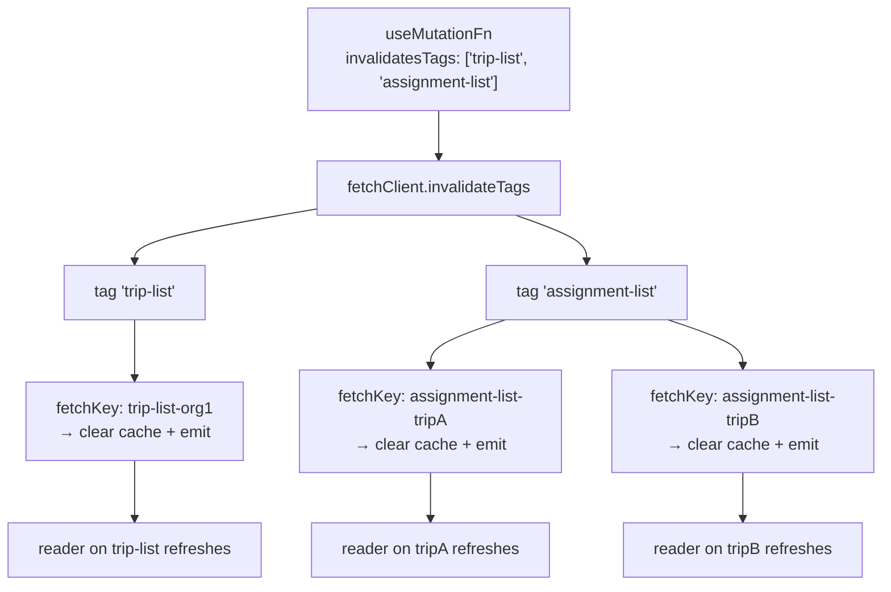

# useMutationFn — Write & Invalidate Flow

The **write** hook: run an async mutation, track `isMutating`, and — on success — **invalidate tags** so
every mounted reader ([`useFetch`](./USE-FETCH-FLOW.md) / [`useFetchFn`](./USE-FETCH-FN-FLOW.md))
subscribed to those tags re-reads.

> **The one idea that defines this flow.** A mutation's success does two things in one pass: it **clears
> the cached promises** of every `fetchKey` associated with the invalidated tags, and it **emits** those
> tags so mounted readers refetch. Writes and reads never reference each other directly — they are wired
> only through shared tag strings.

---

## Where it fits

The **cache clear** and the **emit** are complementary: the emit refreshes readers that are _mounted
now_; the clear guarantees a reader that mounts _later_ starts from a fresh fetch instead of a stale
cached promise.

---

## The flow — execute, then fan out

> **Why invalidate runs _before_ `onSuccess`.** By the time `onSuccess` runs, the cache has already
> been cleared and readers already notified — so any navigation or UI update we do in `onSuccess`
> happens on top of an already-invalidated cache, not a stale one.

> **Why `invalidateTags` both clears _and_ emits.** An emit alone would refresh only mounted readers; an
> unmounted reader would keep its stale cached promise and show old data when it remounts. Clearing the
> cache for the tag's `fetchKey`s closes that gap — the next mount re-fetches. The two together cover
> both "visible now" and "mounted later".

> **Why dropping the tag → fetchKeys entry doesn't break the `emit`.** The two live in _separate_
> registries. The `tag → fetchKeys` entry is only a cache-key index — it says which cached promises to
> delete; once they're gone it's stale, so it's dropped and later rebuilt when readers re-register via
> `cachePromiseAndRegisterTags`. The `emit` walks `eventEmitter`'s own subscriber list, which the drop never
> touches — so mounted readers still get notified.

---

## Tag fan-out — one write, many reads

A tag maps to a **set** of `fetchKey`s (built as readers register via `cachePromiseAndRegisterTags`). Invalidating
one tag reaches **every** reader that ever subscribed to it — the fan-out is by tag membership, not by
which component issued the write.

---

## Notes

- **Collection vs entity tags.** A broad tag (`'entity-list'`) refreshes _every_ reader of that
  collection in one write — simple, at the cost of refetching readers that may not have changed. A
  narrow, per-entity tag (`'entity-list-' + id`) refreshes exactly one. Choosing the granularity is
  the caller's modeling decision; fetchwire treats every tag identically.
- **`onSuccess` receives the unwrapped `data`.** The success callback is passed `response.data ?? null`,
  the same payload shape readers get.
- **Unmounting the caller does not abandon the write.** A mutation whose component unmounts before the
  request settles still invalidates its tags and still calls `onSuccess` / `onError`. Only `setState`
  is lost, and only because React drops it — the cache and the caller's callbacks are not the
  component's to cancel. Write `onSuccess` / `onError` so they tolerate running after their component
  is gone: reach for a router, a store, or an alert rather than a `setState` the caller no longer owns.
- **`reset()`** clears `{ data, isMutating }` back to idle. It does not touch the cache or emit anything.

---

**Readers that react to invalidation:** [USE-FETCH-FLOW](./USE-FETCH-FLOW.md) ·
[USE-FETCH-FN-FLOW](./USE-FETCH-FN-FLOW.md).
**Warming a reader's cache before it mounts:** [PREFETCH-FLOW](./PREFETCH-FLOW.md).
