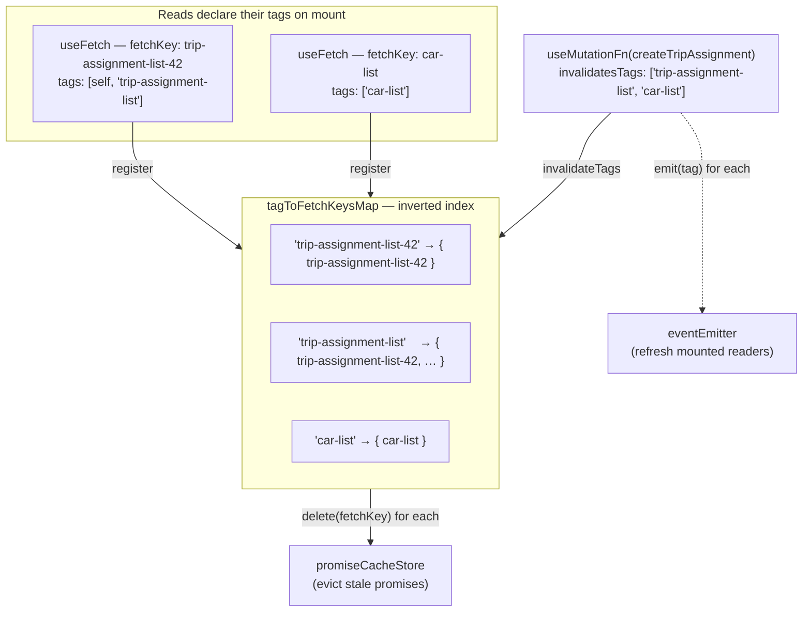

# Tag-Based Cache Invalidation Pattern

How fetchwire answers the hardest question in caching: _after a write, which cached reads are now stale —
and how do we refresh exactly those, nothing more?_

This is the same model used by RTK Query (`providesTags` / `invalidatesTags`) and Next.js (`cacheTag` /
`revalidateTag`): a **read declares the tags it belongs to**, a **write declares the tags it invalidates**,
and the library maps between them. In fetchwire that mapping lives in [`fetchClient`](../../src/core/fetch-client.ts).

---

## What

### The problem, from first principles

fetchwire caches every read's promise under a `fetchKey` in a module-level store
([`promiseCacheStore`](../../src/core/promise-cache-store.ts)), so the same request is not fired twice. The
moment you cache, you inherit **staleness**: a mutation elsewhere can make a cached entry wrong, and the
next reader of that key would serve the outdated copy.

So a write must be able to say "these cached reads are now invalid." The naïve way — the writer names the
exact `fetchKey`s to clear — does not work: the writer usually has no idea which keys exist. A single
"create assignment" call cannot know that keys `trip-assignment-list-42` and `car-list` happen to be mounted
right now. **The writer knows the _kind_ of thing it changed, not the _identities_ of the reads affected.**

Tags bridge that gap. A tag is a **name for a kind of data**; the writer speaks in tags, the library
translates tags back into the concrete `fetchKey`s to evict.

### Two identifiers on two different axes

The whole pattern rests on not conflating these:

|                 | `fetchKey`                                                    | `tag`                                          |
| --------------- | ------------------------------------------------------------- | ---------------------------------------------- |
| **Answers**     | "_which_ data is this?"                                       | "_what kind_ of data is this?"                 |
| **Granularity** | one specific read                                             | a group of reads                               |
| **Role**        | unit of **caching / eviction** (one key ↔ one cached promise) | unit of **invalidation** (one tag ↔ many keys) |
| **Declared by** | every read (`useFetch`/`useFetchFn`/`prefetch`)               | reads (`tags`) and writes (`invalidatesTags`)  |
| **Example**     | `trip-assignment-list-42`                                     | `trip-assignment-list`                         |

A mutation invalidates **tags**; the cache evicts **fetchKeys**. The library is the translator in between.

### The relationship is many-to-many

Both directions are "many":

- **One tag → many fetchKeys.** `trip-assignment-list` covers every per-trip list: `…-42`, `…-99`, …
- **One fetchKey → many tags.** A reader may declare `tags: ['trip-assignment-list-42', 'trip-assignment-list']`
  — that one key belongs to two groups at once.

### How fetchwire represents it — an inverted index

fetchwire stores **only one direction** of that many-to-many relation:

```ts
// fetch-client.ts
private tagToFetchKeysMap = new Map<string, Set<string>>();
//                              tag           Set<fetchKey>
```

This is an **inverted index**: keyed by tag, valued by the set of fetchKeys carrying that tag. It is stored
this way — and _only_ this way — because there is exactly **one query** the system ever runs:

> given a **tag**, which **fetchKeys** must I evict?

That is what `invalidateTags` needs, and the map answers it in O(1) per tag. The reverse direction
(`fetchKey → tags`) is never queried, so it is never stored — it would be redundant state to keep in sync.
The `fetchKey → many tags` fact is still fully represented, **implicitly**: the same key string simply sits
inside several tag-Sets at once.



### Two invalidation mechanisms, one call

`invalidateTags(tags)` drives **two independent channels** — this split is the crux of correctness:

|                        | Channel A — `eventEmitter`                                          | Channel B — `tagToFetchKeysMap`                                          |
| ---------------------- | ------------------------------------------------------------------- | ------------------------------------------------------------------------ |
| **Purpose**            | refresh readers **currently mounted**                               | evict cache for readers **not mounted**                                  |
| **How**                | reader subscribed each tag on mount → `emit(tag)` fires its refresh | delete every fetchKey linked to the tag from `promiseCacheStore`         |
| **If it were missing** | a visible list would keep showing old data                          | an unmounted screen would re-mount later onto a **stale cached promise** |

Channel A keeps live UI correct _now_; Channel B keeps the cache correct for _later_. A write needs both,
which is why `invalidateTags` both deletes keys **and** emits.

### The two write-side methods

Only new promises should overwrite the cache; tag links must be registered in **both** the fresh-fetch and
the cache-hit path. Hence two methods on `fetchClient`:

- **`cachePromiseAndRegisterTags(fetchKey, promise, tags?)`** — store a _new_ promise **and** register its tags.
  Used on a cache **miss** or a **refresh**.
- **`registerTags(fetchKey, tags?)`** — register tags **without** touching the cached promise.
  Used on a cache **hit** (e.g. a key warmed by [`prefetch`](../architecture/PREFETCH-FLOW.md)), so a reader
  that reuses an existing promise still enters its tags into the index. Skipping this would leave that key
  unreachable by Channel B — a stale-cache-on-next-mount bug.

---

## Why

- **Reads vastly outnumber writes, and one write fans out to many reads.** A single edit may need to refresh
  a detail screen, a list, and a calendar view at once. Tags let one `invalidatesTags` reach all of them
  without the writer enumerating a single `fetchKey`.
- **The writer is decoupled from the readers.** A mutation names the _kinds_ it affects (`'car-list'`); it
  never needs to know which concrete lists are mounted. Readers come and go; the tag contract stays fixed.
- **Invalidation is O(1) per tag and surgical.** The inverted index turns "evict everything under this tag"
  into a direct `Map.get`. Two-tier tagging (below) means an edit touches exactly the affected group and
  nothing else — no blanket cache purge.
- **The accepted trade-off: dangling entries.** Because only `tag → keys` is indexed, fetchwire cannot
  cheaply remove a single `fetchKey` from every tag-Set it appears in. `remove(fetchKey)` clears the cache
  but leaves the key lingering in the index; `invalidateTags` deletes the whole tag entry but a key shared
  with another tag survives there. This is harmless — a later `delete` on an already-absent key is a no-op —
  and it is chosen deliberately over maintaining a second reverse index purely for cleanup.

---

## How

### Rule 1 — `fetchKey` is the identity of a read

Name it so two reads are "the same" iff they should share a cache entry. Convention: `resource-${id}` for a
single entity, `resource-list-${scope}` for a scoped list.

```ts
fetchKey: `trip-${tripId}`; // one entity
fetchKey: `trip-assignment-list-${tripId}`; // a scoped list
```

### Rule 2 — every reader tags itself: per-entity tag + collection tag(s)

Declare the specific tag (usually the fetchKey itself) **and** every collection the read belongs to. The
per-entity tag enables a targeted refresh of just this read; the collection tag lets "anything of this kind
changed" refresh all such reads.

```ts
const { data } = useFetch(() => getTripAssignments(tripId), {
  fetchKey: `trip-assignment-list-${tripId}`,
  tags: [`trip-assignment-list-${tripId}`, "trip-assignment-list"],
  //      └── per-entity (this list) ──┘   └── collection (all such lists) ──┘
});
```

### Rule 3 — a write invalidates every collection and entity it actually changed

`invalidatesTags` lists the narrowest tags that became stale — the affected collection(s) **and**, when a
specific entity changed, that entity's tag. Never a broader tag than the write truly touched.

```ts
useMutationFn((input) => updateTrip(tripId, input), {
  invalidatesTags: ["trip-list", `trip-${tripId}`],
});
```

### Rule 4 — cross-domain writes invalidate the _other_ domains they affect

The subtle case. When a write changes state that a **different** domain's reads depend on, invalidate that
domain's tags too, even though the mutation "belongs" to another resource. This is where fetchKeys and tags
genuinely overlap across domains (see Example 3).

### Rule 5 — keep tags meaningful; never over- or under-invalidate

- Do not invalidate a tag the write did not change (over-invalidation defeats the cache).
- Do not omit an affected tag (under-invalidation serves stale data).
- Do not pass empty-string tags; a read with no tags contributes nothing to the index and is unreachable by
  Channel B.

### Rule 6 — when prefetching, pass the same tags

`prefetch` warms a key before any reader mounts. Passing `tags` to it registers the `tag → fetchKey` link
immediately, closing the window between the prefetch and the first mount during which an `invalidateTags`
could not yet reach that key. → [PREFETCH-FLOW](../architecture/PREFETCH-FLOW.md).

---

## Worked examples

The examples build up from a single read to a cross-domain overlap. Picture an app that manages **trips**,
the **cars** assigned to them, and personal **wage** / **project** records shown in both list and calendar
views — a domain where one change ripples across several screens.

### Example 1 — Two-tier tagging

A per-trip assignment list subscribes to both its own identity and its collection:

```ts
useFetch(() => getTripAssignments(tripId), {
  fetchKey: `trip-assignment-list-${tripId}`,
  tags: [`trip-assignment-list-${tripId}`, "trip-assignment-list"],
});
```

- Editing **this** trip's assignments → invalidate `` `trip-assignment-list-${tripId}` `` (this list only).
- A bulk operation affecting **all** assignment lists → invalidate `'trip-assignment-list'` (every such list
  at once).

One read, two levers: fine (per-entity) and coarse (collection).

### Example 2 — One write, many readers (fan-out)

A wage record is shown by **three** different reads: a detail screen, a monthly list, and a calendar view.
Each has its own `fetchKey`, unified by tags:

```ts
// Reads (three separate screens/providers)
useFetch(() => getWage(wageId), {
  fetchKey: `wage-${wageId}`,
  tags: [`wage-${wageId}`],
});
useFetch(() => getWageList(month), {
  fetchKey: `wage-list-${month}`,
  tags: ["wage-list"],
});
useFetch(() => getWageCalendar(month), {
  fetchKey: `wage-calendar-${month}`,
  tags: ["wage-calendar"],
});

// One write refreshes all three at once
useMutationFn((input) => updateWage(wageId, input), {
  invalidatesTags: [`wage-${wageId}`, "wage-list", "wage-calendar"],
});
```

The mutation names three tags and never touches a `fetchKey`. Whichever of the three reads are mounted
refresh via Channel A; those unmounted have their keys evicted via Channel B and refetch fresh on next mount.

### Example 3 — Cross-domain scheduling conflict (the overlap that matters)

Assigning a car to a trip changes **two** domains at once. The obvious one is the trip's assignment list.
The non-obvious one: a car booked on trip A is no longer free for trip B at the same time — so **every read
of car availability is now stale too**. The write must reach across the domain boundary:

```ts
useMutationFn(() => createTripAssignment({ tripId, carId }), {
  invalidatesTags: ["trip-assignment-list", "car-list"],
  //                 └── own domain ──┘      └── the domain whose availability changed ──┘
});
```

This is exactly why tags and fetchKeys overlap heavily in a scheduling app: the _same_ write is a member of
multiple tag groups because it perturbs multiple resources' schedules. Miss the cross-domain tag and the
symptom is a classic double-booking bug — the car list still shows a car as available that was just assigned.

### Example 4 — Reading the inverted index: an overlap matrix + a trace

Suppose these reads are mounted:

```ts
useFetch(…, { fetchKey: 'trip-assignment-list-42', tags: ['trip-assignment-list-42', 'trip-assignment-list'] });
useFetch(…, { fetchKey: 'trip-assignment-list-99', tags: ['trip-assignment-list-99', 'trip-assignment-list'] });
useFetch(…, { fetchKey: 'car-list',                tags: ['car-list'] });
useFetch(…, { fetchKey: 'car-7',                   tags: ['car-7', 'car-list'] });
```

The `tagToFetchKeysMap` now holds (columns = tags, ✓ = the row's fetchKey is in that tag's Set):

| fetchKey \ tag            | `trip-assignment-list-42` | `trip-assignment-list-99` | `trip-assignment-list` | `car-7` | `car-list` |
| ------------------------- | :-----------------------: | :-----------------------: | :--------------------: | :-----: | :--------: |
| `trip-assignment-list-42` |             ✓             |                           |           ✓            |         |            |
| `trip-assignment-list-99` |                           |             ✓             |           ✓            |         |            |
| `car-list`                |                           |                           |                        |         |     ✓      |
| `car-7`                   |                           |                           |                        |    ✓    |     ✓      |

Read the many-to-many off the table two ways:

- **1 tag → n fetchKeys:** column `trip-assignment-list` has two ✓ → it covers both `…-42` and `…-99`.
- **1 fetchKey → n tags:** row `car-7` has two ✓ → it belongs to both `car-7` and `car-list`.

Now trace `createTripAssignment({ tripId: 42, carId: 7 })` → `invalidateTags(['trip-assignment-list', 'car-list'])`:

1. Tag `'trip-assignment-list'` → Set `{ trip-assignment-list-42, trip-assignment-list-99 }` → evict both
   from `promiseCacheStore`; `emit('trip-assignment-list')` refreshes both mounted lists.
2. Tag `'car-list'` → Set `{ car-list, car-7 }` → evict both; `emit('car-list')` refreshes them.
3. Untouched: nothing else. `trip-assignment-list-42` as an _entity_ tag was not invalidated on its own — it
   was reached only through the collection, exactly as intended.

Note the overlap payoff: `car-7` was refreshed even though the write never mentioned car 7 — because it
carries the `car-list` tag. That is the whole point of the collection tag.

---

## Notes

- **Tags are matched by exact string.** There is no hierarchy or wildcard; `'car-list'` does not imply
  `'car-7'`. Overlap is achieved only by a read carrying **multiple** tags.
- **Tag strings must not contain commas.** Reads join their tags into a single key with `,`, so a comma in a
  tag would split it. (This is why a read with no tags degenerates to `['']`, which the index ignores.)
- **A rejected read stays cached.** Invalidation clears entries by tag; to force a single failed key to
  refetch outside the tag system, use `fetchClient.remove(fetchKey)`.

**See also:** [USE-MUTATION-FN-FLOW](../architecture/USE-MUTATION-FN-FLOW.md) (what emits invalidation) ·
[USE-FETCH-FLOW](../architecture/USE-FETCH-FLOW.md) / [USE-FETCH-FN-FLOW](../architecture/USE-FETCH-FN-FLOW.md)
(how a read subscribes) · [PREFETCH-FLOW](../architecture/PREFETCH-FLOW.md) (warming a key before mount).
